# Manual testing

Here is a list of the manual testing that was carried out to ensure that the Lifesort API works as intended at the time of deployment. These tests are designed to test each created view for functionality.

The intended functionality of Lifesort is that users can only access their own profile and tasks and an error should be returned to the user if they have attempted to access a task or a profile of another user.

All users of the site should be able to create, read, update and delete tasks and create, read, update their own profile.

## Django installed correctly

I manually tested early and throughout the process of building the Lifesort API. That started with ensuring Django had installed correctly.

- [x] Test Django had installed correctly

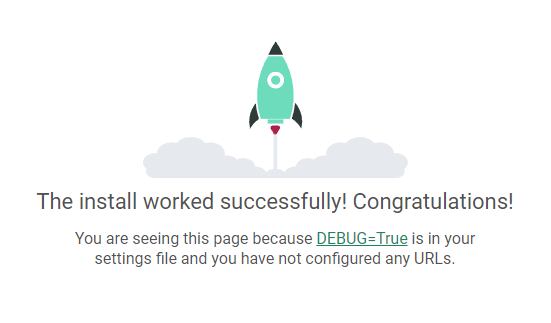

## Root route view

The root route exists to show a welcome message to a user who visits the API and shows the API is working.

- [x] Test when a user visits the API they are shown a welcome message.

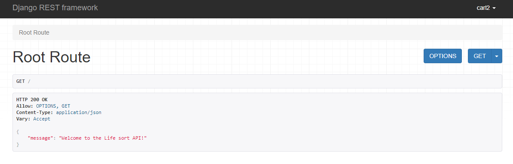

- [x] Test deployed welcome message screen.

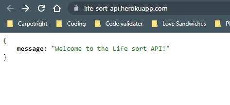

## Profile views

I tested the profile views to ensure that users can only see their own profile and edit their own profile as well there is no delete option for the profile view.

- [x] Test a user cannot see a profile if they are not logged in.

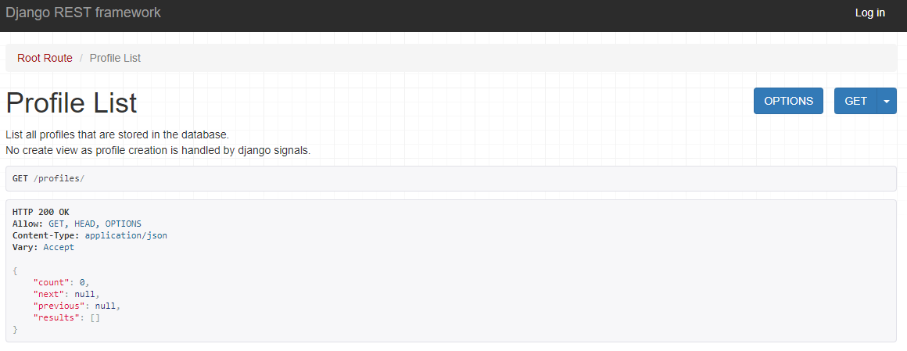

- [x] Test when a user is logged in they cannot access another profile.

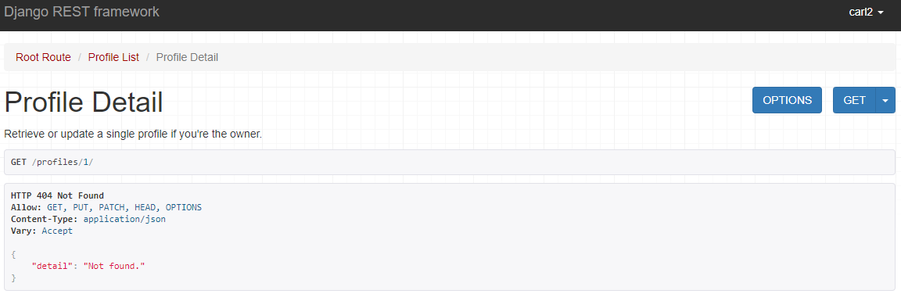

- [x] Test a user can access their own profile when logged in.

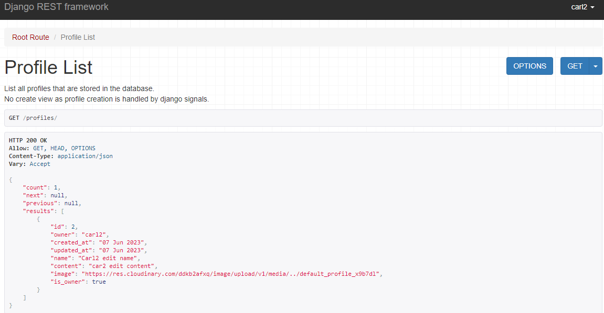

- [x] Test a user can edit their own profile when logged in.

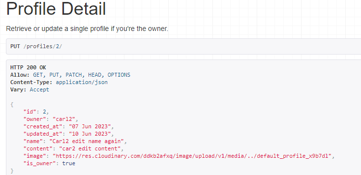

## Quick task views

I tested the quick task views to ensure users can only access their own tasks are have full CRUD control as well.

- [x] Users can create a quick task.

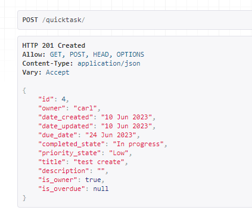

- [x] Users can access their own quick task.

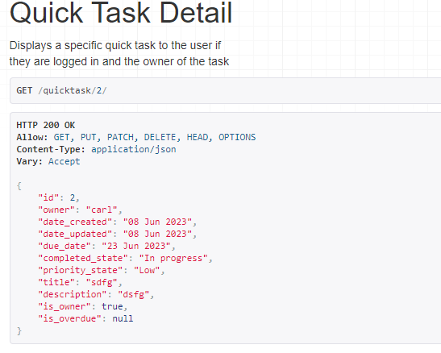

- [x] Users can edit a quick task.

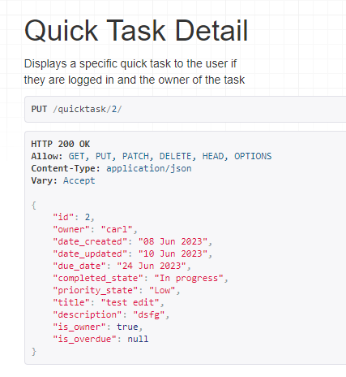

- [x] Users can delete a quick task.

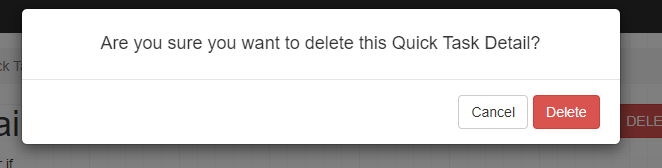

- [x] Users cannot create a quick task woth a due date more than 1000 days in future.

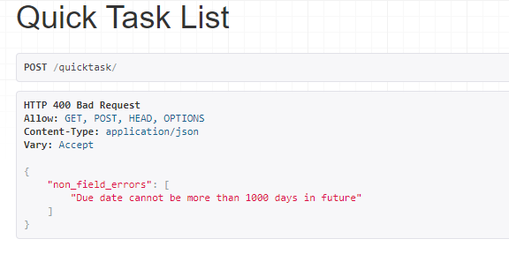

- [x] Users cannot create a quick task with a due date in the past.

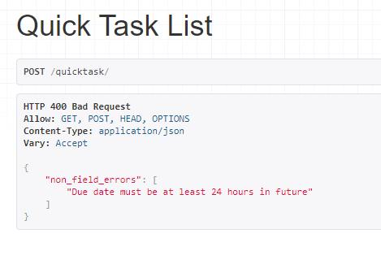

- [x] Users cannot access another users quick task.

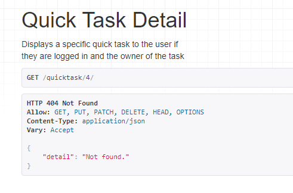

- [x] logged in user can access their own quick task list.

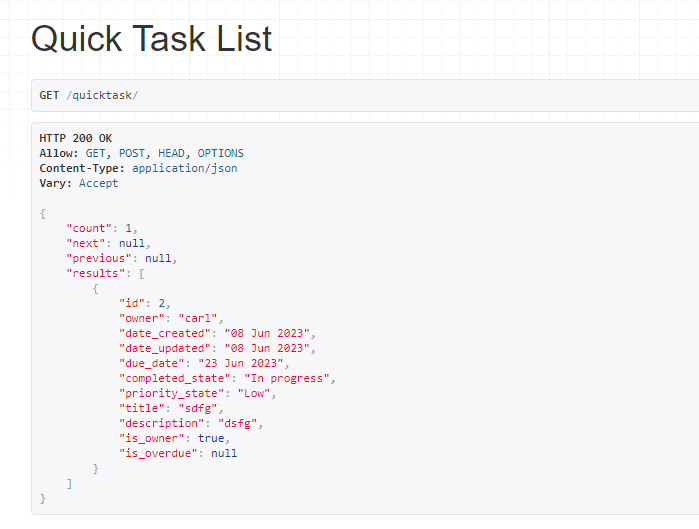

- [x] logged out user cannot access quick task list.

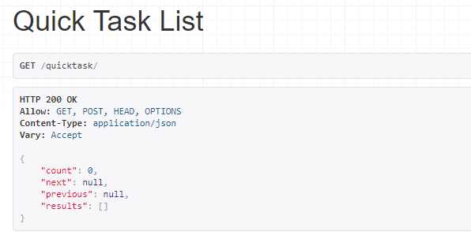

