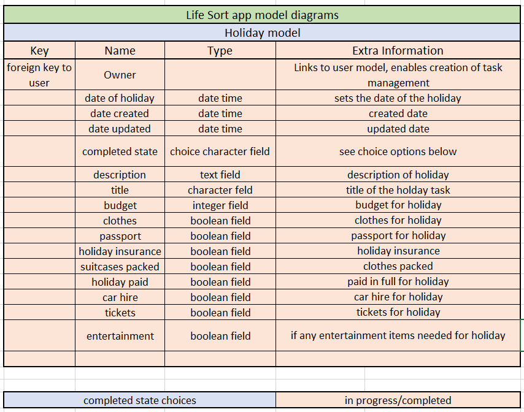

# Lifesort - Back-end API

Lifesort is a task management application, it allows users of the site to sign up and login with their own profile. From there they are able to create tasks: A detailed custom task, a lesser detailed quick task and also holiday tasks.

The custom task option allows the user to create a more detailed task with the ability to create a title, description, set a due date, set a start date among other options as well. The aim for the custom task option is to be able to set a task or an event that would require extra detail such as setting up an event for an annual meeting.

The quick task option allows users to create a less detailed task with the ability to create a title, description, priority, due date, and current status of task. The aim for the quick task option is allow users to create a list of normal everyday tasks that would need completing such as mowing the grass. 

The holiday task option allows users to create a detailed task list focused on what would be required for a holiday. The aim for the holiday task option is to allow users of the site to organise themselves for a future trip away.

Users of the site have full CRUD control over their own tasks with the ability to see their tasks all at once if they are using a desktop computer or in separate lists they can click on a task to see a single task. The user has access to the edit function and delete function throughout these pages. If a user is on a smaller device they have access to all of the tasks created but due to the application having infinite scroll the access is separated out to each individual list of tasks created. 

Users of the site also have access to their own profile page and have the ability to edit their profile and update their profile image which is displayed in the navigation bar of the application.

Lifesort was designed with the focus on an application that can be used on desktop computers but also on mobile devices as well.

Due to the nature of the application I designed the tasks within the application to only be accessed by the task owner and this goes same for the profile model.

Lifesort has a separate front-end built with React and a back-end built with the Django-Rest-Framework. Both of the front-end and back-end have been deployed on [Heroku](https://www.heroku.com/) This README is for the back-end API section of the application.

### Deployed back-end API [Lifesort back-end API live site](https://life-sort-api.herokuapp.com/)
### Deployed front-end site [Lifesort front-end live site](https://life-sort.herokuapp.com/)
### Front-end repository [Lifesort front-end repository](https://github.com/carl2087/life-sort-task-app)

## Planning

Planning for the application was based on an agile methodology utilising GitHubs issues and projects tabs to create user stories for the site. There are user stories which are for the project goals of the site and what I wanted to achieve and I set up project tasks as well which incorporate the what is required for each step of the project.

The user stories requiring implementation to achieve a minimimum viable product where then mapped to API endpoints to required to support the desired functionality. 

[Lifesort Kanban board](https://github.com/users/carl2087/projects/10)

[Lifesort project tasks](https://github.com/users/carl2087/projects/11)

[Lifesort user stories](https://github.com/carl2087/life-sort-task-app/issues)

## Database Schema

The database schemas were planned with th APi endpoints using an entity realtionship diagram.

### Profile model

The profile model is to allow the user of the site to create their own profile. It serves an important purpose as it links to all of the tasks models to link everything together.

The profile model contains the following fields:

 * id - Automatically generated by the Django-rest-framework which is unique to each profile instance.
 * owner - One to one relationship with a specific user instance.
 * date created - Date and time for the creation of the profile.
 * date updated - Date and time when the profile was last updated.
 * image - Image that is displayed witin the users profile.

### Custom task model

The custom task model is designed to allow the user to set a more detailed task that has multiple options and plan for a bigger event task in the future.

The custom task model containds the following fields:

 * owner - Primary key of the user who generated the task.
 * date created - Date and time for the creation of the task.
 * date updated - Date and time when the task was last updated.
 * due date - The due date of the task.
 * start date - The date that the user expects to start the task.
 * completed state - Choice list allowing the user to choose from in progress/overdue/completed.
 * priority state - Choice list allowing the user to set priority of task low/medium/high.
 * description - Description of the task.
 * title - Title of the task.
 * travel required - If travel is required for the task.
 * budget - Budget requirements for the task.
 * work or leisure - If the task is for work or leisure purposes.

### Quick task model

The quick task model is designed to let a user create a short quick task.

The quick tast model contains the following fields:

 * owner - Primary key of the user who generated the task.
 * date created - Date and time for the creation of the task.
 * date updated - Date and time when the task was last updated.
 * due date - The due date of the task.
 * completed state - Choice list allowing the user to choose from in progress/overdue/completed.
 * priority state - Choice list allowing the user to set priority of task low/medium/high.
 * title - Title of the task.
 * description - Description of the task.

### Holiday task model

The holiday task model is designed to let a user create and plan for a holiday with various holiday focused options to make planning for a holiday less stressful. The holiday task model would work better in a mobile app setting as items could be ticked off quicker and this was the main focus of this model for a future verison of the application.

The holiday task model contains the following fields.

 * owner - Primary key of the user who generated the task.
 * date created - Date and time for the creation of the task.
 * date updated - Date and time when the task was last updated.
 * title - Title of the task.
 * description - Description of the task.
 * completed state - Choice list allowing the user to choose from in progress/overdue/completed.
 * date of holiday - Date of holiday.
 * budget - Cost of holiday.
 * clothes - If any clothes are required for holiday.
 * passport - If passport is required.
 * holiday insurance - If any insurancees are required.
 * suitcases packed - Suicases fully packed.
 * holiday paid - Holiday paid in full yet.
 * car hire - If car hire is needed.
 * tickets - If any tickets are required.
 * entertainment - If there is any entertainment needs.

## Testing

I thoroughly tested Lifesort API with both manual testing and automated testing to ensure the application was working as designed and expected.

### Manual testing

The manual testing I completed can be found here: [Manual Testing](MANUAL_TESTS.md). It describes the steps I went thorugh to manually ensure the API is working correctly.

I also ran the code I wrote through the [Code Institute linter](https://pep8ci.herokuapp.com/) to ensure the code I wrote was free from errors.

### Automated testing

I also wrote a series of automated testing suites in order to further test and uncover any hidden bugs that may not have been discovered with the manual test. The autmated testing also further reinforces the manual tests.

Here is the results from the testing within the terminal.

I also installed and used [Coverage python testing](https://coverage.readthedocs.io/en/7.2.7/) to ensure I was testing as much of my code as possible.

## Resolved Bugs

Any bugs that were found during testing are documented in the user stories bug section. 

### When testing the API bugs found where as follows

#### Receiving a warning in terminal regarding unordered lists

 * I checked all models.
 * Custom task model did not contain a class meta.
 * Added in the class meta.
 * Ran all migrations.
 * Checked tests were now passing.

#### During testing was able to create a minus budget for custom tasks

 * Checked models were correct.
 * Checked custom task serializer.
 * Added budget into serializer.
 * Ran migrations.
 * Checked tests were passing.

#### During manual testing discovered could set due date before start date in custom task model

 * Researched how to validate dates correctly I referenced this [Dev Diary](https://www.flaviabastos.cadjango-rest-framework-adding-datetimefield-format-serializer-validation/).
 * Removed the validation from the model to the serializer.
 * Checked tests were passing.
 * Updated all models to have the date validation in the serializer.

#### During final deploy to Heroku kept on receiving error messages

 * Checked the heroku build log.
 * Check all config vars were correct.
 * Checked Procfile was correct.
 * Found error in Procfile it was not configured correctly. I updated the code and deployed the APi tested it and it was working as intended.

## Unresolved bugs

To the best of my knowledge there are no further bugs left in the API code.

## Technologies used

### Main languages used

 * Python

### Frameworks, Libraries & Programs used:

 * Django
 * Django Rest Framework
 * Django Rest Auth
 * Django Allauth
 * Cloudinary
 * Heroku
 * Pillow
 * PostgeSQL
 * CORS Headers
 * Microsoft Excel - used to create database schema
 * Gitpod
 * GitHub

## Deployment

The Lifesort API is deployed to Heroku, using an ElephantSQL Postgres database.
To duplicate deployment to Heroku, follow these steps:

 * Fork or clone this repository in GitHub.
 * You will need a Cloudinary account to host user profile images.
 * Login to Cloudinary.
 * Select the 'dashboard' option.
 * Copy the value of the 'API Environment variable' from the part starting `cloudinary://` to the end. You may need to select the eye icon to view the full environment variable. Paste this value somewhere for safe keeping as you will need it shortly (but destroy after deployment).
 * Log in to Heroku.
 * Select 'Create new app' from the 'New' menu at the top right.
 * Enter a name for the app and select the appropriate region.
 * Select 'Create app'.
 * Select 'Settings' from the menu at the top.
 * Login to ElephantSQL.
 * Click 'Create new instance' on the dashboard.
 * Name the 'plan' and select the 'Tiny Turtle (free)' plan.
 * Select 'select region'.
 * Choose the nearest data centre to your location.
 * Click 'Review'.
 * Go to the ElephantSQL dashboard and click on the 'database instance name' for this project.
 * Copy the ElephantSQL database URL to your clipboard (this starts with `postgres://`).
 * Return to the Heroku dashboard.
 * Select the 'settings' tab.
 * Locate the 'reveal config vars' link and select.
 * Enter the following config var names and values:
    * `CLOUDINARY_URL`: *your cloudinary URL as obtained above*
    * `DATABASE_URL`: *your ElephantSQL postgres database URL as obtained above*
    * `SECRET_KEY`: *your secret key*
    * `ALLOWED_HOST`: *the url of your Heroku app (but without the `https://` prefix)*
 * Select the 'Deploy' tab at the top.
 * Select 'GitHub' from the deployment options and confirm you wish to deploy using GitHub. You may be asked to enter your GitHub password.
 * Find the 'Connect to GitHub' section and use the search box to locate your repo.
 * Select 'Connect' when found.
 * Optionally choose the main branch under 'Automatic Deploys' and select 'Enable Automatic Deploys' if you wish your deployed API to be automatically redeployed every time you push changes to GitHub.
 * Find the 'Manual Deploy' section, choose 'main' as the branch to deploy and select 'Deploy Branch'.
 * Your API will shortly be deployed and you will be given a link to the deployed site when the process is complete.

## Credits and acknowledgements

 * Code Institute Rest Framework walkthrough which helped when building this API.
 * Django Rest Framework documentation which helped me understanding some of the concepts.
 * Validating the dates in the serializer came from this [Dev Diary](https://www.flaviabastos.cadjango-rest-framework-adding-datetimefield-format-serializer-validation/).

I would like to extend a thank you to my mentor Martina Terlevic whose advice cannot be underestimated. Also to my previous mentor Victor Miclovich who has given helped throughout my other projects.